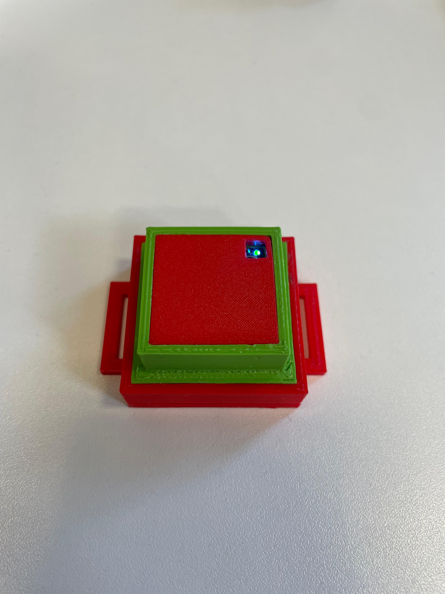
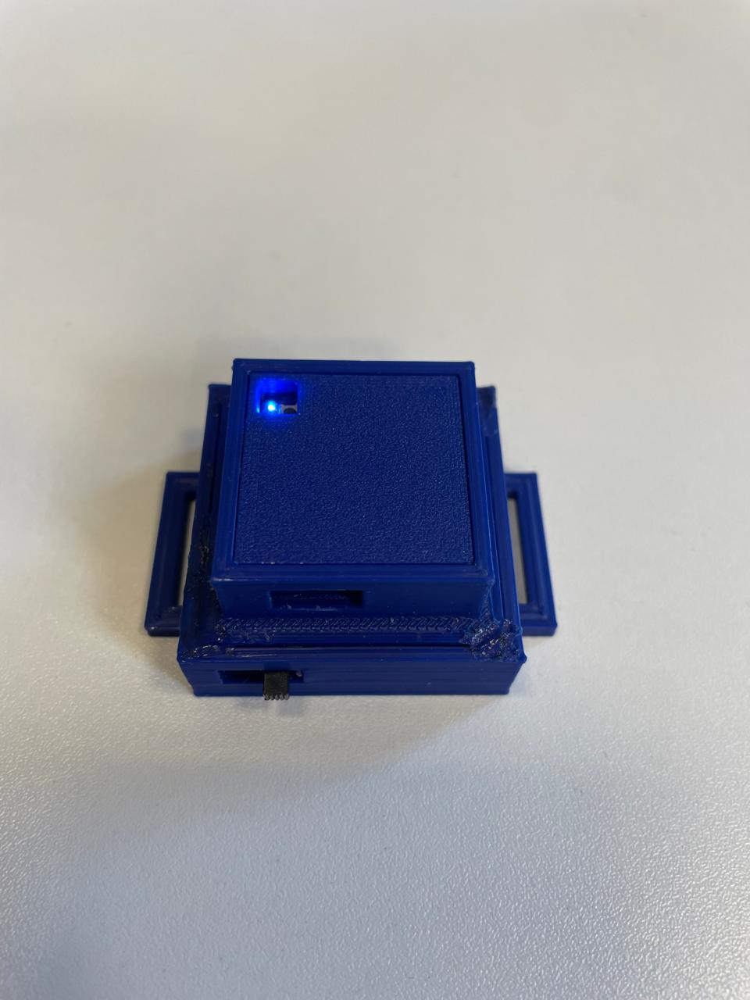

# 🧠 Nicla-Neuroscience-GUI

**Nicla-Neuroscience-GUI** is a real-time Python GUI interface for visualizing and comparing motion data — including **acceleration**, **gyroscope**, and **orientation** — from **two Arduino Nicla Sense ME** devices.

It supports **USB** and **Bluetooth Low Energy (BLE)** and is designed for **neuroscience experiments**, **human–robot interaction**, and **biomechanical research**.

---

## 🎯 Project Purpose

This project is designed to:

- 🧬 Record and display **acceleration**, **gyroscope**, and **orientation** data in real time  
- 🤖 Compare motion between a human and a robot to support **adaptive behavior modeling**  
- 📊 Save data for offline analysis, machine learning, or scientific reporting  
- 🖥️ Provide a smooth and customizable **PyQt5-based GUI**

---

## 🧠 Scientific Motivation

Studying how humans and robots move under different conditions is key in:

- Human–robot collaboration  
- Rehabilitation robotics  
- Cognitive-motor interaction research  
- Sensor fusion and motion prediction  

This tool offers a simple but powerful interface to:

- Capture and compare motion  
- Visualize orientation with a 3D cube  
- Export time-based data for further exploration  

---

## 📦 Hardware Setup

Each Nicla Sense ME board is mounted in a **3D-printed case** and worn on the wrist like a **watch ⌚**, ideal for capturing natural motion during activities like reaching, grasping, or gesturing.

| Human Nicla (wrist-mounted) | Robot Nicla |
|-----------------------------|-------------|
|  |  |


> 🧩 The enclosure ensures stability  
> 🔁 Both Niclas use the **same Arduino code**, so they are interchangeable

---

## 📸 Interface Preview


---

## 📋 Folder Structure

```
Nicla-Neuroscience-GUI/
├── README.md # Project overview
├── images/ # GUI + hardware photos
│ ├── nicla_human.jpg
│ ├── nicla_robot.jpg
│ └── gui_preview.jpg
├── LICENSE # MIT license file
├── Nicla_Version/
│ ├── arduino/
│ │ └── nicla_motion_data.ino # Arduino code (BLE/USB)
│ ├── nicla.py # GUI application
│ ├── requirements.txt # Python dependencies
```

---

## 📊 Types of Data Captured

The system captures motion data using the **Bosch BHI260AP IMU** embedded in the Nicla Sense ME. The following data types are collected:

| Sensor Type       | Axes / Fields       | Unit     |
|-------------------|---------------------|----------|
| Acceleration       | x, y, z             | m/s²     |
| Gyroscope          | x, y, z             | °/s      |
| Orientation (IMU)  | roll, pitch, yaw    | degrees  |

---

## 📁 Excel Output (Examples)

### 🟦 When using **one Nicla only**:

| timestamp | ax    | ay    | az    | gx    | gy    | gz    | roll  | pitch | yaw   |
|-----------|-------|-------|-------|-------|-------|-------|-------|-------|-------|
| 0.000     | -0.12 | 9.81  | 0.01  | 0.00  | 0.01  | 0.00  | 2.3   | -1.1  | 89.4  |
| 0.010     | -0.11 | 9.79  | 0.03  | 0.00  | 0.02  | 0.00  | 2.4   | -1.0  | 89.5  |

---

### 🟰 When using **both Niclas together** (combined in one file):

| timestamp | ax    | ay    | az    | gx    | gy    | gz    | roll  | pitch | yaw   | source  |
|-----------|-------|-------|-------|-------|-------|-------|-------|-------|-------|---------|
| 0.000     | -0.12 | 9.81  | 0.01  | 0.00  | 0.01  | 0.00  | 2.3   | -1.1  | 89.4  | Nicla 1 |
| 0.000     | -0.09 | 9.80  | 0.02  | 0.01  | 0.00  | 0.01  | 2.1   | -1.2  | 89.6  | Nicla 2 |

> 📥 The user chooses whether to save the data after stopping the session.

---

## 🧰 Technologies Used

- Python 3  
- PyQt5  
- PyQtGraph (2D & OpenGL 3D cube)  
- BLE communication via Bleak  
- Excel export using OpenPyXL  
- NumPy for numerical calculations  

---

## ⚙️ Installation

Install dependencies:

```bash
pip install -r requirements.txt
```

Run the GUI:

```bash
python nicla.py
```

---

## 🔧 Arduino Code

The Arduino firmware used for both devices is located at:

```bash
arduino/nicla_motion_data.ino
```

It reads and streams:

- 📈 **Acceleration** (X/Y/Z)  
- 🔄 **Gyroscope** (X/Y/Z)  
- 🧭 **Orientation** (roll, pitch, yaw)

📡 Data is sent via **Bluetooth (BLE)** or **USB serial**, formatted in **JSON**.

---

## 🧩 Example GUI Initialization (Python)

```python
self.nicla1 = NiclaWidget(
    "Nicla Human",
    port_default="COM10",
    ble_address="63:E8:45:79:A9:EB",
    cube_color="red"
)

self.nicla2 = NiclaWidget(
    "Nicla Robot",
    port_default="COM11",
    ble_address="4D:14:4E:C0:2B:C8",
    cube_color="blue"
)
```

---

## 🚀 Future Work

- 🧮 **Add filtering** (Kalman filter or low-pass filter)  
- ⏱ **Improve time synchronization** between the two devices  
- 🧠 **Add gesture classification** using AI models  
- ☁️ **Integrate cloud export** (Firebase, Supabase, etc.)

---

## 🤝 Contributions

You’re welcome to contribute:

- 🔧 Improve graphing performance  
- 🧭 Add new sensors (e.g., magnetometer)  
- 🧪 Submit experiment ideas or test scenarios  

Feel free to fork the repository, open issues, or submit pull requests.

---

## 📜 License

**MIT License**  
Free to use for research, education, and commercial applications.

---

## 👤 Author

**Hadi El Ayoubi**  
🤖 Robotics Engineering Student  
⌚ Creator of the dual Nicla wrist-mounted interface  
🇫🇷 Based in France
